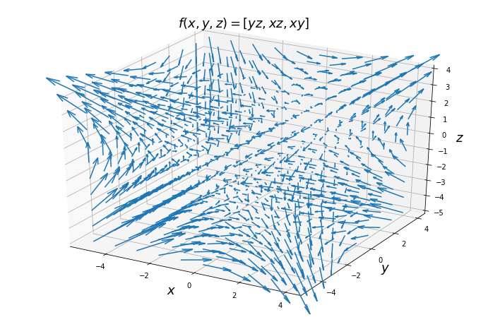
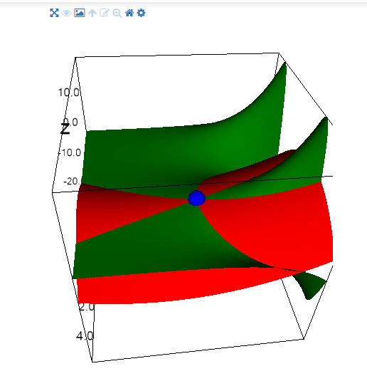

# Multivariable Calculus

The course website: https://www.khanacademy.org/math/multivariable-calculus

## [About this course](https://www.khanacademy.org/math/multivariable-calculus)
Object: multivariable functions

Operators:
- derivative
- gradient
- divergence
- curl
- Laplacian

## [Contents](https://github.com/TaiChiTiger/multivariable-calculus)
- __Part I: Thinking about multivariable functions__
  - [Visualizing scalar-valued functions](https://github.com/TaiChiTiger/multivariable-calculus/tree/master/P1.thinking-about-multivariable-functions/1.visualizing-scalar-valued-functions)
  - [Visualizing vector-valued functions](https://github.com/TaiChiTiger/multivariable-calculus/tree/master/P1.thinking-about-multivariable-functions/2.visualizing-vector-valued-functions)
- __Part II: Derivatives of multivariable functions__
  - [Partial derivatives](https://github.com/TaiChiTiger/multivariable-calculus/tree/master/P2.derivatives-of-multivariable-functions/1.partial-derivatives)
  - [Gradient and directional derivatives](https://github.com/TaiChiTiger/multivariable-calculus/tree/master/P2.derivatives-of-multivariable-functions/2.gradient-and-directional-derivatives)
  - [Partial derivatives of vector-valued functions](https://github.com/TaiChiTiger/multivariable-calculus/tree/master/P2.derivatives-of-multivariable-functions/6.partial-derivatives-of-vector-valued-functions)
  - [Divergence](https://github.com/TaiChiTiger/multivariable-calculus/tree/master/P2.derivatives-of-multivariable-functions/7.divergence)
  - [Laplacian](https://github.com/TaiChiTiger/multivariable-calculus/tree/master/P2.derivatives-of-multivariable-functions/9.laplacian)
  - [Jacobian](https://github.com/TaiChiTiger/multivariable-calculus/tree/master/P2.derivatives-of-multivariable-functions/10.jacobian)
- __Part III: Applications of multivariable derivatives__
  - [Quadratic approximations](https://github.com/TaiChiTiger/multivariable-calculus/tree/master/P3.application-of-multivariable-functions/2.quadratic-approximations)
  - [Optimizing multivariable functions](https://github.com/TaiChiTiger/multivariable-calculus/tree/master/P3.application-of-multivariable-functions/3.optimizing-multivariable-functions)
  - [Lagrange multipliers and constrained optimization](https://github.com/TaiChiTiger/multivariable-calculus/tree/master/P3.application-of-multivariable-functions/4.lagrange-multipliers-and-constrained-optimization)
- __Part IV: Integrating multivariable functions__
  - [Line integrals for scalar functions](https://github.com/TaiChiTiger/multivariable-calculus/tree/master/P4.integrating-multivariable-functions/1.line-integrals-for-scalar-functions)
  - [Line integrals in vector fields](https://github.com/TaiChiTiger/multivariable-calculus/tree/master/P4.integrating-multivariable-functions/2.line-integrals-in-vector-fields)
  
## Some Features
Use 3 libaries to visualize functions:
- `matplotlib`
- `ipyvolume`
- `plotly`

**`matplotlib`**

 

**`ipyvolume`**

 

**`plotly`**
A "Function Visualizer" can be accessed: https://function-visualizer.herokuapp.com/

 
